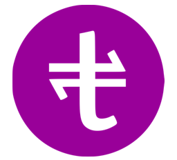

# <div style='display:flex;align-items:center;gap:1em'> <div style='display:inline-flex'>TRANZAK Nodejs API client</div></div>

    This client allows the use of TRANZAK APIs via Nodejs.
The documentation for the REST APIs, can be found [<b style='font-size:1.35em'>here</b>](https://docs.developer.tranzak.me/).

## Usage
#### Just flow with the code-completion.

For example

```js
    import TRANZAK from 'tranzak-node'
    const client = new TRANZAK(
        {
            appId: 'aprb1ozfx10r31',
            appKey: '939AC5BF3348EA37FC24C34209AF71DC',
            mode: 'sandbox', // You can as well use 'live', or leave it blank. Leaving blank, also means, 'live'
        }
    );

    
    const transaction = await client.payment.collection.simple.chargeMobileMoney(
        {
            amount: 27_000,
            currencyCode: 'XAF',
            description: `Payment for shoes`,
            payerNote: `Payment for shoes.`,
            mchTransactionRef: shortUUID.generate(),
            mobileWalletNumber: `237677683958`,
        }
    )
    // Some time later
    await transaction.refresh()


    if (transaction.data.status === 'SUCCESSFUL') {
        console.log(`Our client just confirmed the transaction.\nHow sweet!`)

        // And later

        //Let's send the money to the payout account
        const collectionAccount = (await client.account.list()).find(acc => acc.data.accountId === transaction.data.merchant.accountId);

        await client.payment.transfer.simple.toPayoutAccount(
            {
                amount: 25_200,
                currencyCode: 'XAF',
                customTransactionRef: collectionAccount.data.accountId,
                description: `For payouts`,
                payeeNote: 'For payouts.',
                fundingAccountId: collectionAccount.data.accountId
            }
        );


        await client.payment.transfer.simple.toMobileMoney(
            {
                payeeAccountId: '237677683958',
                amount: 25_100,
                currencyCode: 'XAF',
                customTransactionRef: shortUUID.generate(),
                description: `For procurement of materials.`,
                payeeNote: `Procument of materials`,
            }
        );

        console.log(`Money successfully transferred to the procurement officer.`)

    }

    // Or, for other non-direct payment methods, use web redirect.
    const transaction = await client.payment.collection.simple.chargeByWebRedirect(
        {
            mchTransactionRef: shortUUID.generate()
        }
    );

    console.log(`Dear client, go to `, transaction.links.paymentAuthUrl)

```

## Payment Methods
<blockquote >Mobile Money payments can be handled directly, using <b style='color:#79a'>payment.transfer.simple.toMobileMoney()</b> or <b style='color:#79a'>payment.collection.simple.chargeMobileMoney()</b>.

All other payments such as card, and bank, are handle via <b style='color:#afb'>web redirect</b>.
</blockquote>

<div style='color:transparent;min-height:8em'>
---
</div>


 

#### Proudly created, and maintained by [<b>HolyCorn Software</b>](https://github.com/HolyCorn-Software).